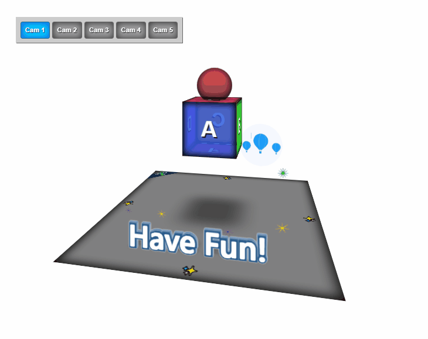
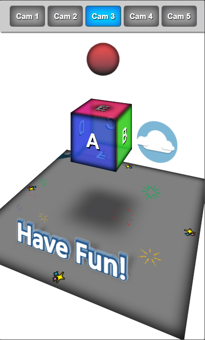
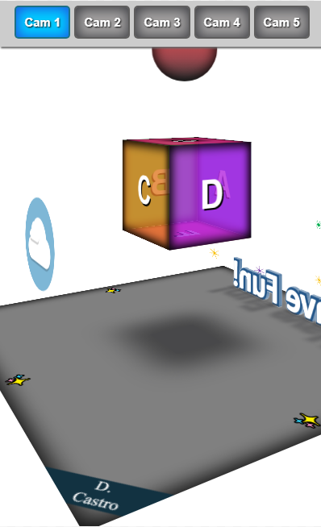

# 3d cube
O projeto apresenta uma cena tridimensional de um cubo com objetos dinâmicos, foi desenvolvido (sem o uso de frameworks), com o objetivo de consolidar os conhecimentos do css 3d por meio da aplicação de suas propriedades, bem como, praticar a utilização de animações(keyframes).
Todo o projeto foi feito usando somente HTML, CSS. Foi usado o Javascript no menu, para permitir com que a troca de perspectiva da cena ocorresse ao clicar nos diferentes botões de câmera "cam".

<a href="https://dcastrodev.github.io/3d-cube/">🔗 Live Demo</a>

## Linguagens
- HTML5
- CSS3
- JS

### Propriedades em foco
- perspective
- transform: scale, rotate, translate (x, y, z)
- animations, keyframes
- filter

## Layout Preview

### PC

 

### Mobile

